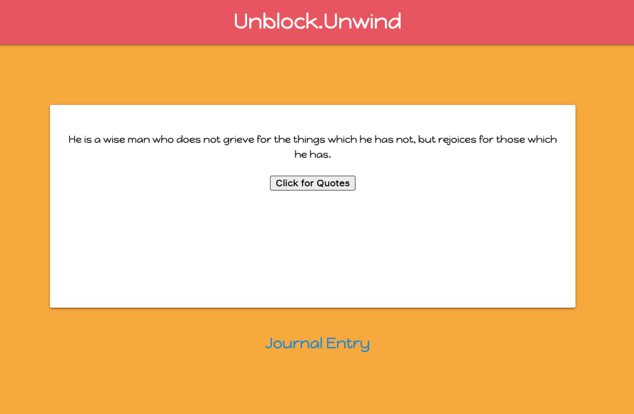
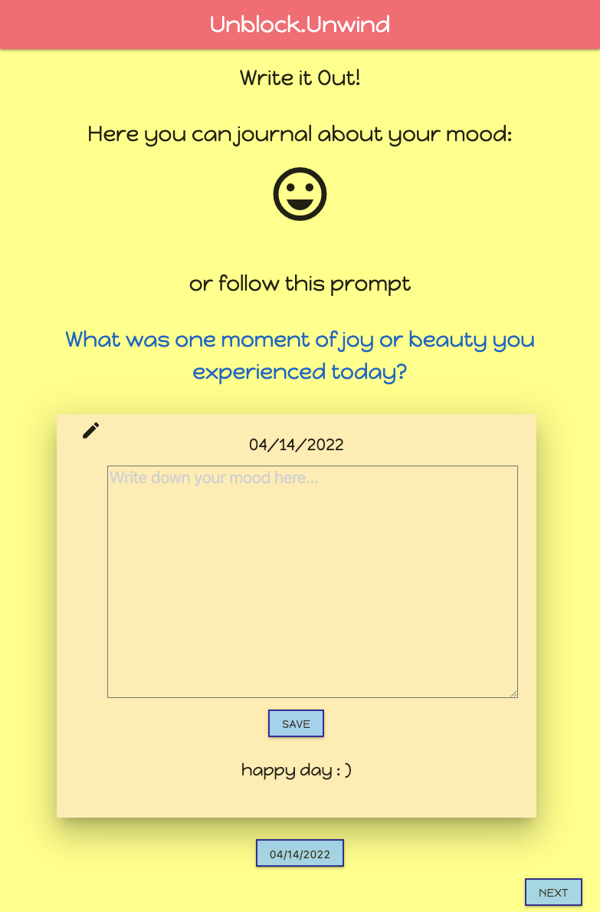
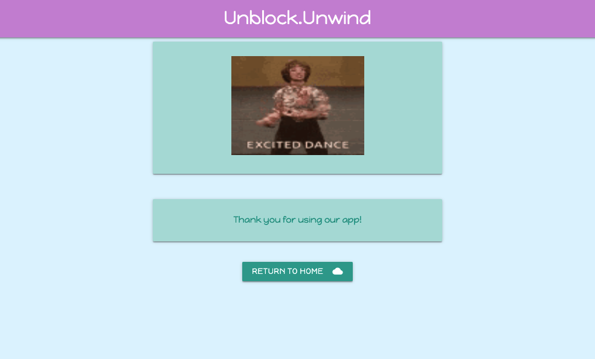

# Unblock-Unwind 

## Link 
### Please click [here](https://christinaa126.github.io/unblock-unwind/) to find the deployed project.

## Description

This is an application that encourages software developers to take a break to cure their creative block and/or unwind from their current task. User will be able to select their daily mood and be given a random dad joke and motivational quote followed by the option to log a journal entry.


## Table of Contents

If your README is long, add a table of contents to make it easy for users to find what they need.

- [Link](#link)
- [Description](#description)
- [Usage](#usage)
- [Credits](#credits)
- [Technology](#technology)
- [Assets](#assets)


## Usage

Here is a simple introduction of how to use our application:
- Click an emoji that represents your mood today
- You have the options to select the following three buttons:
    - Humor
    - Both
    - Inspiration
- Dependings on which buttons you selected, you will see a quote, a joke, or both
    - If you want to see more qutoes or jokes, you can click on the buttons for more
- Click on the Journal Entry link to move to next page
- Your selected emoji will be displayed again and you will also see a random prompt that you can journal about
- Write down your journal and save it in the application
    - A date button will be triggered after saving your journal and you can click on that button to review your previous journal entries
    - Click on Next button to move to next page
- You will be treated with a random funny GIF to show our thanks for using the application
    - Click on the Return To Home button to restart the application


## Credits

This application is using 3 Third-Party APIs:
- [Dad Jokes API](https://rapidapi.com/KegenGuyll/api/dad-jokes/)
- [Tenor API](https://tenor.com/gifapi/documentation#endpoints-trendingterms)
- [Quotes Free API](https://forum.freecodecamp.org/t/free-api-inspirational-quotes-json-with-code-examples/311373)

Here is a list of our collaborators:
- [Christina Christiansen](https://github.com/christinaa126)
- [Ryan Saldaen](https://github.com/Rsaldaen)
- [Kevin Wang](https://github.com/ohdeer31)
- [Qiling Deng](https://github.com/qd9069)


## Technology

```md
- JavaScript
- jQuery
- HTML
- CSS
- Materialize
- Google Font
- Moment.js
- Tenor API
```

## Assets

The following images demonstrate the web application's appearance and functionality:





---

🏆  Code originally by team Brogrammers in 2022


